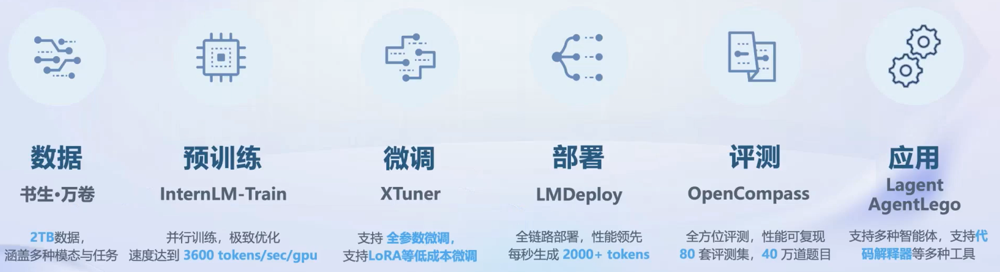

# 浦语大模型全链路开源体系

大模型 - 逐渐成为热门 ——> *成为发展通用人工智能的重要途径*

- 专用模型： 针对特定任务，用于解决某些特定问题的独立模型 (围棋、蛋白质预测)
- 通用大模型：一个模型即可应对多种模态下的多种任务 (GPT series)

## 书生·浦语大模型系列
- （开源）轻量级: InternLM-7B - *社区低成本可用最佳模型*
    - 70亿模型参数，小巧轻便，便于部署
    - 10000亿训练token数据，信息全面，能力多维
    - 具备长语境能力，支持8k语境窗口长度
    - 具备通用工具调用能力，支持多种工具调用模板
    - 性能 
        - 领先相近量级开源模型
        - 以不足三分之一的参数量，达到Llama2-70B水平

- （开源）中量级: InternLM-20B - *商业场景可开发定制高精度* 
    - 200亿参数量，在模型能力与推理代价间取得平衡
    - 采用深而窄的结构，降低推理计算量但提高了推理能力
    - 4k训练语境长度，推理时可外推至16k 

- 重量级: InternLM-123B - *通用大语言模型能力全面覆盖* 
    - 1230亿模型参数， 强大的性能
    - 具备极强的推理能力、全面的知识覆盖面、超强理解能力与对话能力

 
## 从模型到应用 
- 应用领域
    - 智能客服
    - 个人助手
    - 行业应用

- 通用步骤
    - 模型选型
    - 续训/全参数微调(算力充足) 或 部分参数微调(算力不足)  (*业务场景复杂*)
    - 构建智能体(需要环境交互)
    - 模型评测
    - 模型部署
        - 吞吐量、延迟问题
- 

## 书生·浦语全链条开源开放体系
- 
- 应用层面
    - Lagent: 轻量级智能体搭建框架
    - AgentLego: 提供了供大模型调用的工具箱及标准化工具接口

### 开放体系 | 数据
- 书生·万卷 1.0 （）: 包括文本数据、图像-文本数据集、视频数据，总数据量超过2TB
    - 多模态融合: 包含多种模态,内容涵盖多个领域
    - 精细化处理: 提供更加精细的模型训练数据
    - 价值观对齐: 对其主流价值观，保持语料库纯净度
