# 浦语大模型全链路开源体系

大模型 - 逐渐成为热门 ——> *成为发展通用人工智能的重要途径*

- 专用模型： 针对特定任务，用于解决某些特定问题的独立模型 (围棋、蛋白质预测)
- 通用大模型：一个模型即可应对多种模态下的多种任务 (GPT series)

## 书生·浦语大模型系列
- （开源）轻量级: InternLM-7B - *社区低成本可用最佳模型*
    - 70亿模型参数，小巧轻便，便于部署
    - 10000亿训练token数据，信息全面，能力多维
    - 具备长语境能力，支持8k语境窗口长度
    - 具备通用工具调用能力，支持多种工具调用模板
    - 性能 
        - 领先相近量级开源模型
        - 以不足三分之一的参数量，达到Llama2-70B水平

- （开源）中量级: InternLM-20B - *商业场景可开发定制高精度* 
    - 200亿参数量，在模型能力与推理代价间取得平衡
    - 采用深而窄的结构，降低推理计算量但提高了推理能力
    - 4k训练语境长度，推理时可外推至16k 

- 重量级: InternLM-123B - *通用大语言模型能力全面覆盖* 
    - 1230亿模型参数， 强大的性能
    - 具备极强的推理能力、全面的知识覆盖面、超强理解能力与对话能力

 
## 从模型到应用 
- 应用领域
    - 智能客服
    - 个人助手
    - 行业应用

- 通用步骤
    - 模型选型
    - 续训/全参数微调(算力充足) 或 部分参数微调(算力不足)  (*业务场景复杂*)
    - 构建智能体(需要环境交互)
    - 模型评测
    - 模型部署
        - 吞吐量、延迟问题
- 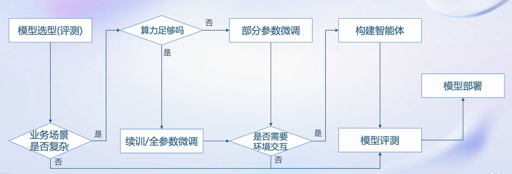

##  书生·浦语全链条开源开放体系
- 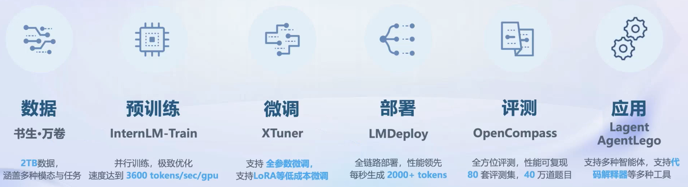
- 应用层面
    - Lagent: 轻量级智能体搭建框架
    - AgentLego: 提供了供大模型调用的工具箱及标准化工具接口

### 开放体系 | 数据
- 书生·万卷 1.0: 包括文本数据、图像-文本数据集、视频数据，总数据量超过2TB
    - 多模态融合: 包含多种模态,内容涵盖多个领域
    - 精细化处理: 提供更加精细的模型训练数据
    - 价值观对齐: 对其主流价值观，保持语料库纯净度
- OpenDataLab: 
    - 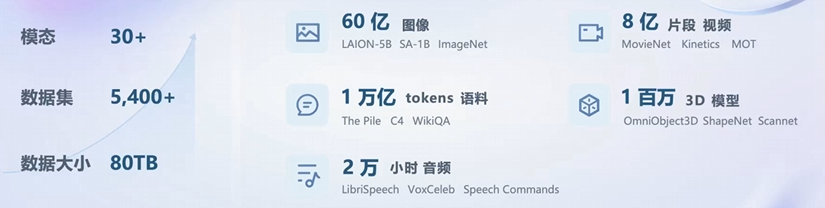

### 开放体系 | 预训练
- 高扩展性
- 极致性能优化
- 兼容主流
- 开箱即用 
- 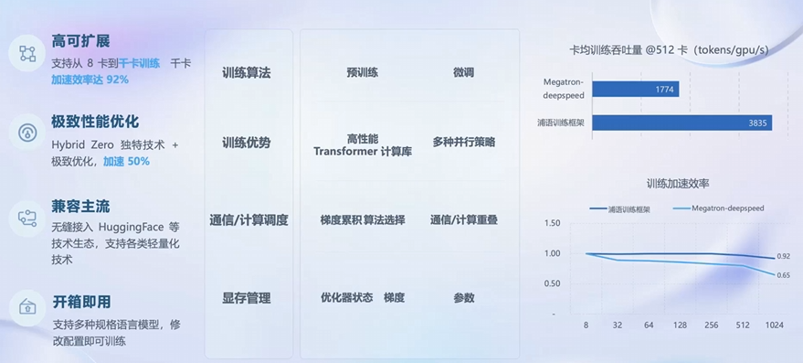

### 开放体系 | 微调
- LLM下游应用两种方式：
    - 增量续训
        - 使用场景:让基座模型学习到一些新知识，如某个垂类领域知识
        - 训练数据:文章、书籍、代码等
    - 有监督微调
        - 使用场景:让模型学会理解和遵循各种指令，或者注入少量领域知识
        - 训练数据:高质量的对话、问答数据 

    - 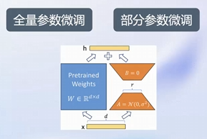

- 高效微调框架 XTuner
    - 适配多种生态
        - 多种微调算法
        - 适配多种开源生态（HuggingFace、ModelScope）
        - 自动优化加速
    - 适配多种硬件
        - 覆盖英伟达20 系列以上所有显卡
        - 最低配置8g可微调7B模型
    
    - 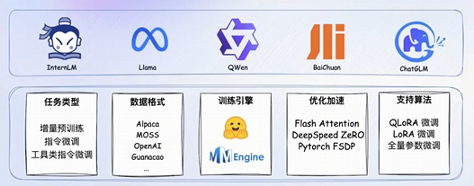

### 开放体系 | 评测
- 国内外评测体系整体态势

    - 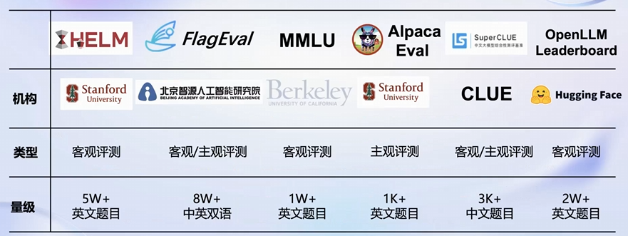
    - OpenCompass

        - 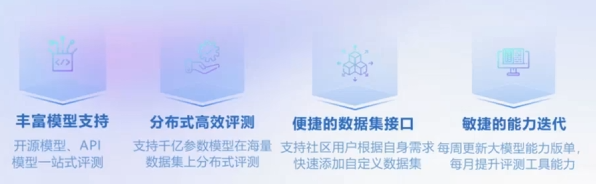

### 开放体系 | 部署
- 大语言模型特点
    - 内存开销巨大
        - 参数量大
        - 缓存kv
    - 动态Shape
        - 请求数不固定
        - token逐个生成
    - 模型结构相对简单
        - 主要是transformer结构
- 技术挑战
    - 设备
        - 消费级显卡部署问题
    - 推理
        - token生成加速
        - 解决推理间断问题
        - 有效管理利用内存
    - 服务
        - 提升吞吐量
        - 降低延迟
    - 技术点
        - 模型并行
        - 低比特量化
        - Attention优化
        - ···

- KMDeploy ——> 提供大模型在GPU上部署的全流程解决方案，包括模型轻量化、推理和服务

- 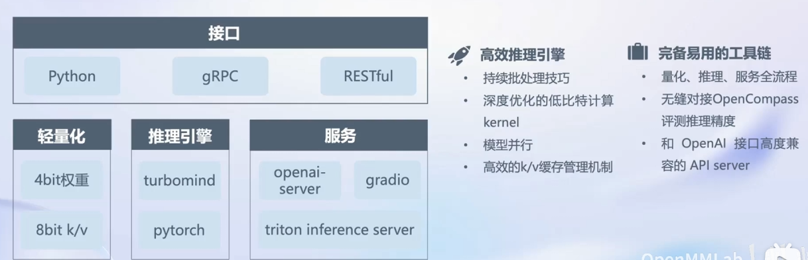

### 开放体系 | 智能体
- LLM局限性
    - 最新消息/知识获取
    - 回复可靠性
    - 数学计算
    - 工具使用和交互

- LL >> 智能体

    - 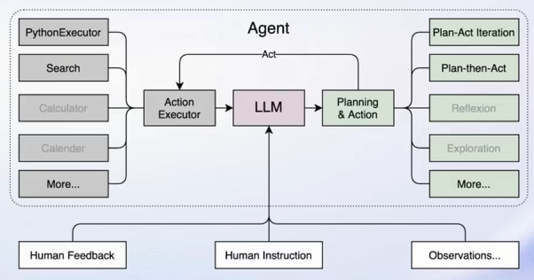

    - 轻量级智能体框架 Lagent
        - 支持多种类型智能体能力
        - 灵活支持多种大语言模型
        - 简单易拓展，支持丰富工具
        - 代码解数学题
        - 零样本泛化： 多模态AI工具使用
    - 多模态智能体工具箱AgentLego
        - 丰富的工具集合，尤其是提供了大量视觉、多模态相关领域的前沿算法功能
        - 支持多个主流智能体系统，如LangChain, Transformers Agent, Lagent 等
        - 灵活的多模态工具调用接口，可以轻松支持各类输入输出格式的工具函数
        - 一键式远程工具部署，轻松使用和调试大模型智能体
        
        - 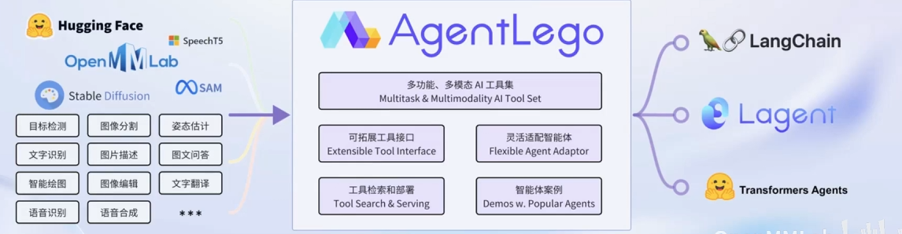