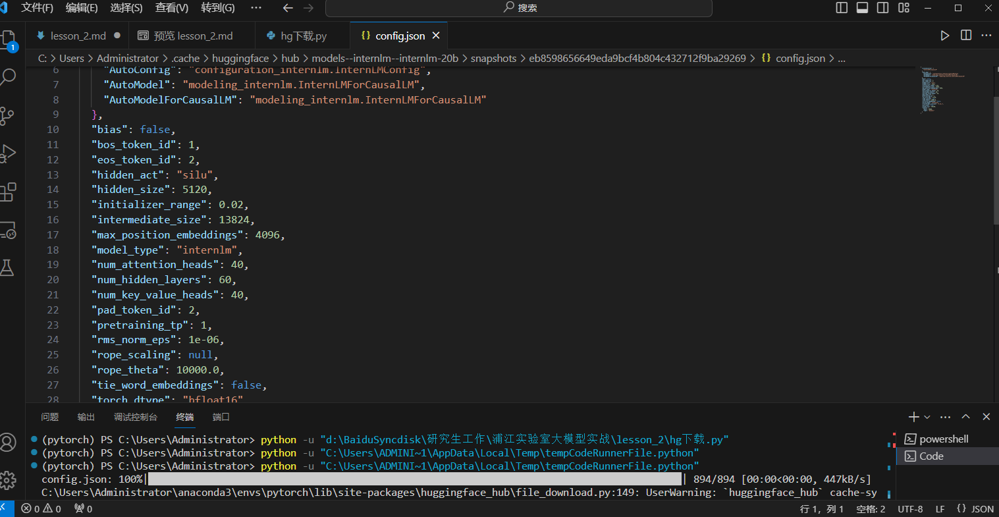

# 轻松玩转书生·浦语大模型趣味 Demo
- 1.InternLM 模型全链条开源
    - InternLM 是一个开源的轻量级训练框架，旨在支持大模型训练而无需大量的依赖。通过单一的代码库，它支持在拥有数千个 GPU 的大型集群上进行预训练，并在单个 GPU 上进行微调，同时实现了卓越的性能优化。在 1024 个 GPU 上训练时，InternLM 可以实现近 90% 的加速效率。
    - 基于 InternLM 训练框架，上海人工智能实验室已经发布了两个开源的预训练模型：InternLM-7B 和 InternLM-20B。
    - Lagent 是一个轻量级、开源的基于大语言模型的智能体（agent）框架，支持用户快速地将一个大语言模型转变为多种类型的智能体，并提供了一些典型工具为大语言模型赋能。通过 Lagent 框架可以更好的发挥 InternLM 的全部性能。
    - 

- 2.InternLM-Chat-7B 智能对话 Demo
    - 终端运行（对话test）
        - 
        - 问题 ： 不知道为什么，对键入的文字进行删除时，会自动生成一个空格字符，进行生成时会报错
        - 

    - 作业（300字小故事）
        - 
        - web_demo测试 + 练习作业
        - 
        
        - web_demo测试踩坑记录
            - 要在打开网页demo的同时在本地终端上同时输入SSH连接的指令才行，哪一个提前或者忘记打开都有可能报错，或者导致web_demo打不开

- 3.Lagent 智能体工具调用 Demo
    - test ＆ 作业
        - 

- 4.浦语·灵笔图文理解创作 Demo
     - test ＆ 作业
        - 《又见敦煌》
        - 《原神外文推广》
        - 《当原神遇上塞尔达》 

- 5.huggingface 下载 & 作业
    - 
    - 