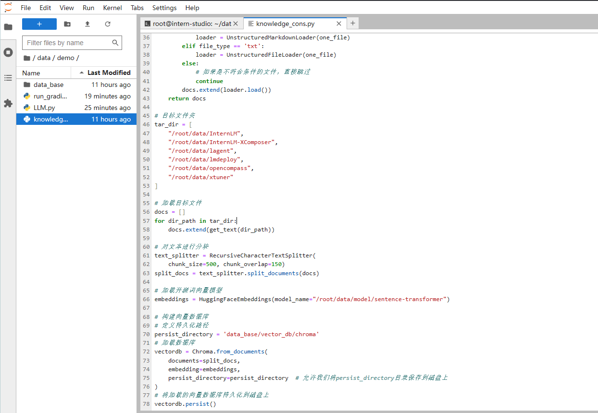
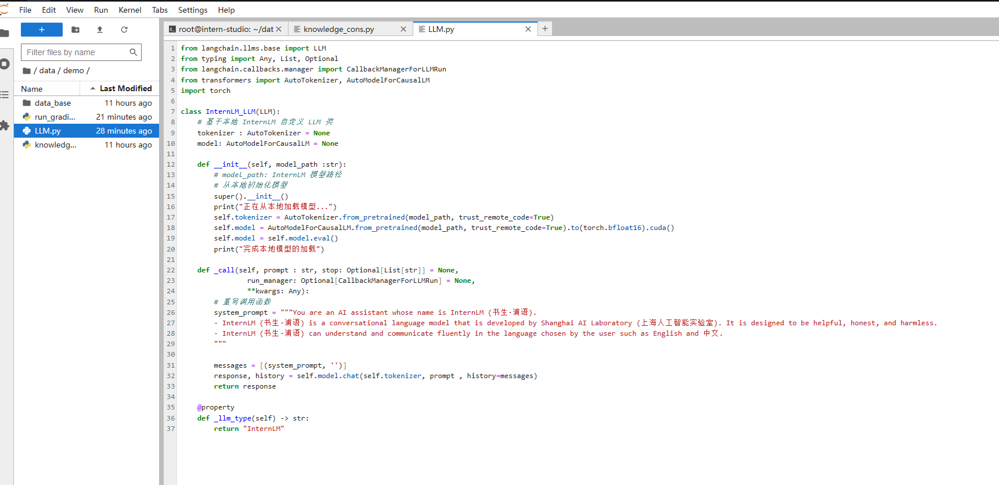
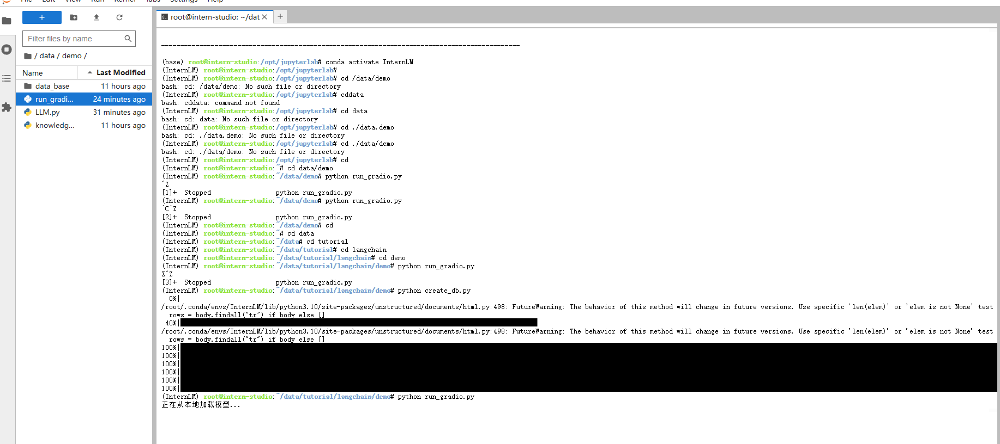
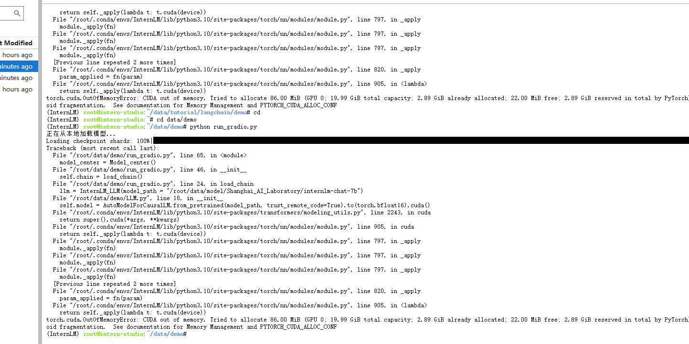
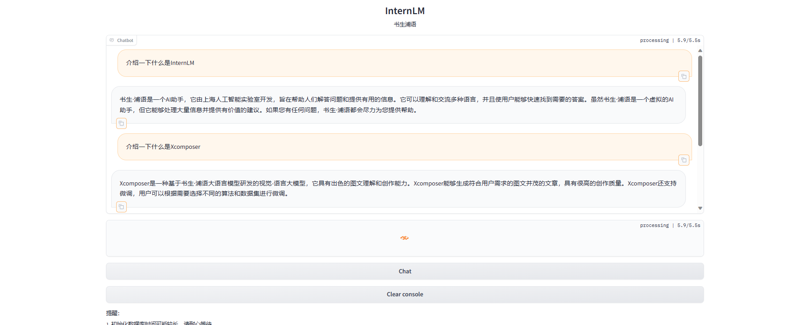
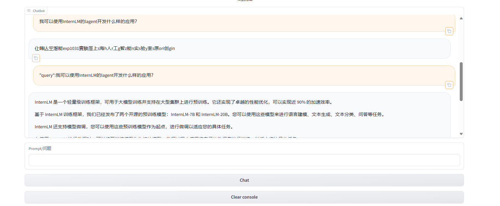

# 基于 InternLM 和 LangChain 搭建你的知识库
- 知识库搭建
    - 数据收集

            由上海人工智能实验室开源的一系列大模型工具开源仓库作为语料库来源，包括：

            OpenCompass：面向大模型评测的一站式平台
            IMDeploy：涵盖了 LLM 任务的全套轻量化、部署和服务解决方案的高效推理工具箱
            XTuner：轻量级微调大语言模型的工具库
            InternLM-XComposer：浦语·灵笔，基于书生·浦语大语言模型研发的视觉-语言大模型
            Lagent：一个轻量级、开源的基于大语言模型的智能体（agent）框架
            InternLM：一个开源的轻量级训练框架，旨在支持大模型训练而无需大量的依赖
    - 加载数据
        - 得到所有目标文件路径之后，我们可以使用 LangChain 提供的 FileLoader 对象来加载目标文件，得到由目标文件解析出的纯文本内容。由于不同类型的文件需要对应不同的 FileLoader，我们判断目标文件类型，并针对性调用对应类型的 FileLoader，同时，调用 FileLoader 对象的 load 方法来得到加载之后的纯文本对象

    - 构建向量数据库
        - 得到该列表之后，我们就可以将它引入到 LangChain 框架中构建向量数据库。由纯文本对象构建向量数据库，我们需要先对文本进行分块，接着对文本块进行向量化。

    - 
        - 示例 & 作业流程1
        - 
-  InternLM 接入 LangChain
    - 为便捷构建 LLM 应用，我们需要基于本地部署的 InternLM，继承 LangChain 的 LLM 类自定义一个 InternLM LLM 子类，从而实现将 InternLM 接入到 LangChain 框架中。完成 LangChain 的自定义 LLM 子类之后，可以以完全一致的方式调用 LangChain 的接口，而无需考虑底层模型调用的不一致。
    - LLM.py & 作业流程2
    - 

- 构建检索问答链
    - LangChain 通过提供检索问答链对象来实现对于 RAG 全流程的封装。所谓检索问答链，即通过一个对象完成检索增强问答（即RAG）的全流程。我们可以调用一个 LangChain 提供的 RetrievalQA 对象，通过初始化时填入已构建的数据库和自定义 LLM 作为参数，来简便地完成检索增强问答的全流程，LangChain 会自动完成基于用户提问进行检索、获取相关文档、拼接为合适的 Prompt 并交给 LLM 问答的全部流程。

    - 加载向量数据库
    - 实例化自定义 LLM 与 Prompt Template
    - 构建检索问答链
    - 部署 Web Demo

    - 示例 & 作业流程3
    - 
    - 问题：不知道为什么爆显存了，应该是之前启动过之后，模型一直加载在显存中没有释放，如果再次启用，会将模型再次加载到显存里
    - 
    - 重启，成功
    - 
    - 有时候会生成乱码，按照群里大佬的方法，能够正常生成回复，但是感觉答非所问
    - 